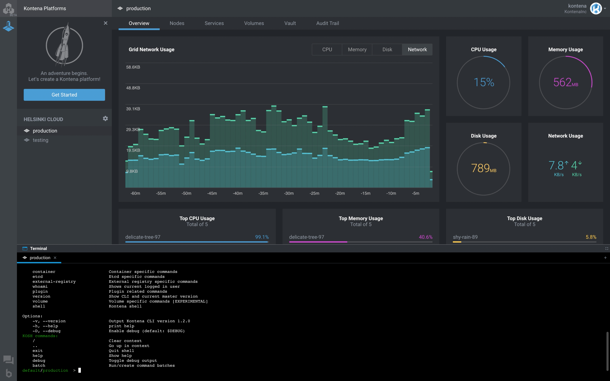

# What is Kontena?

[Kontena](http://www.kontena.io) is the new, better way to run your containers in production. It's [open source](https://www.github.com/kontena/kontena) and easy to use!

# Why Kontena?

Containers promise extreme scalability, portability and improved compute resource utilization. Setting up, tinkering and maintaining a complex container platform framework such as Kubernetes is not where the race is won. Kontena is a developer friendly container platform with all batteries included that is extremely easy to use and works for everybody, on any cloud. Get from zero to hero in matter of minutes rather than days, weeks or months.

If you are looking for a complete, easy to understand and use platform with minimal maintenance and full automation, Kontena is for you! Want to hear what Kontena users are saying? Meet the vibrant and super friendly community of happy developers at [Kontena Slack](https://slack.kontena.io) channel.

# How to Get Started?

If you are new to Kontena, we recommend that you first read through the [quick start](./quick-start.md) guide. We also recommend you to [get familiar with usage](using-kontena/README.md).

# Kontena Key Features

### Orchestration

* **High-Availability** - Designed to be a highly-available distributed system
* **Declarative Service Model** - A configuration model that defines the desired state of various services in a stack
* **Desired State Reconciliation** - Constantly monitors the grid state and reconciles any differences between a desired and an actual state
* **Stateful Services** - Native support for stateful service, like databases
* **Affinity Rules** - Flexible workload placement with easy configuration through stacks
* **Health Checks** - Constantly monitors your service availability and restarts them automatically if they are unavailable

### Volumes

* **On Demand Volumes Creation** - Container volumes are created and attached on the fly
* **Infrastructure Agnostic** - Support for wide range of volume drivers, from cloud to on-premise solutions
* **Scoped Access** - Volume creation can be scoped to multiple levels depending on a use case
* **DevOps Harmony** - Ops can focus on configuring storage systems while devs are happy consumers of those

### Networking

* **Multi-Host Networking** - Every container is automatically assigned with a unique ip-address within a cluster
* **Hybrid Cloud Support** - Integrated peer-to-peer networking approach makes Kontena the ideal choice for hybrid cloud or multi-cloud scenarios
* **Dynamic DNS Addressing** - Each service gets its own intra-cluster dns address so services can find each other within a cluster
* **Multicast Support** - Each service is attached to an ethernet interface that fully emulates a layer 2 network, enabling multicast on any environment

### Security

* **VPN Access** - Integrated OpenVPN for easy access to secure internal network
* **Encrypted Overlay Networking Built-In** - Integrated peer-to-peer network connections are encrypted by default using IPSec
* **Secrets Management** - Secure storage for access tokens, passwords certificates, API keys and other secrets.
* **Let's Encrypt Certificates** - Integrated support for Let's Encrypt certificates
* **Role Based Access Control** - Administrators can assign users to roles per grid

### Load Balancing

* **Application Awareness** - Each service connected to a loadbalancer is configured automatically on-demand
* **TCP Support** - TCP support in addition to HTTP/HTTPS
* **SSL Termination** - Built-in support for SSL termination
* **Health Checks** - Service health checks are automatically configured to a loadbalancer
* **Zero-Downtime** - Zero-downtime deployments are enabled by default using rolling deploys

### Services

* **Stacks** - Pre-packaged and reusable collections of services
* **Auto Scaling** - Elastic scaling on infrastructure changes
* **Rolling Updates** - Update Services with zero-downtime rolling updates
* **Service Discovery** - DNS based service discovery by default, custom etcd discovery for advanced use cases
* **Compose Compatible** - Stack files extend Docker Compose syntax

### Logging & Monitoring

* **Real Time Logs & Stats Streaming** - Container logs and stats are streamed from nodes to the master in real time
* **FluentD Support** - Export log streams via FluentD protocol
* **StatsD Support** - Export container metrics via StatsD protocol
* **Audit Trail** - Keeps track of changes and actions

### Tools

* **Kontena CLI & Kontena Shell** - User friendly command-line interface + slick shell
* **Web UI** - Beautiful web based user interface
* **REST APIs** - Simple JSON REST APIs enable easy integration to external systems
* **Image Registry** - Integrated private image registry
* **Stack Registry** - Stack registry for distributing packaged stacks

# Feedback

This documentation is a work in progress. Any feedback and requests are welcome. If you feel like something is missing, please [open an issue](https://github.com/kontena/docs) on GitHub.

# License

This documentation is licensed under a [Creative Commons Attribution-NonCommercial-ShareAlike 4.0 International License](http://creativecommons.org/licenses/by-nc-sa/4.0/)
