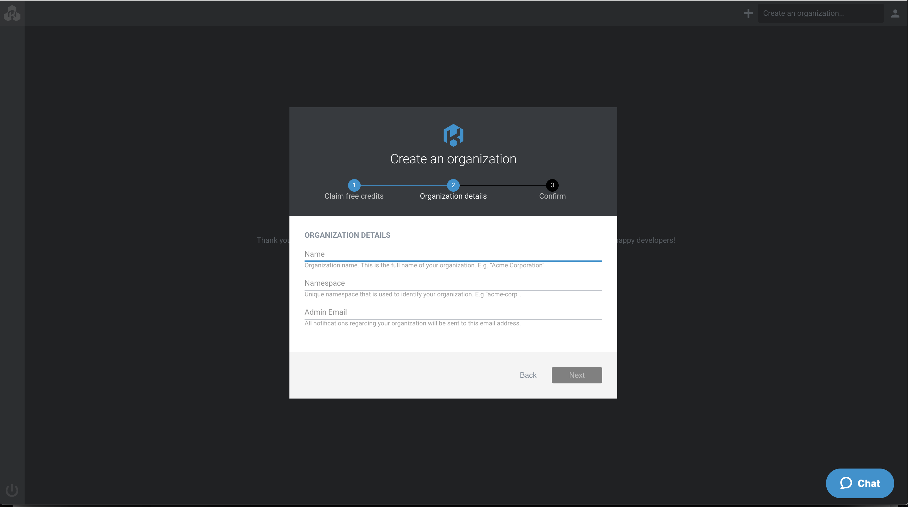
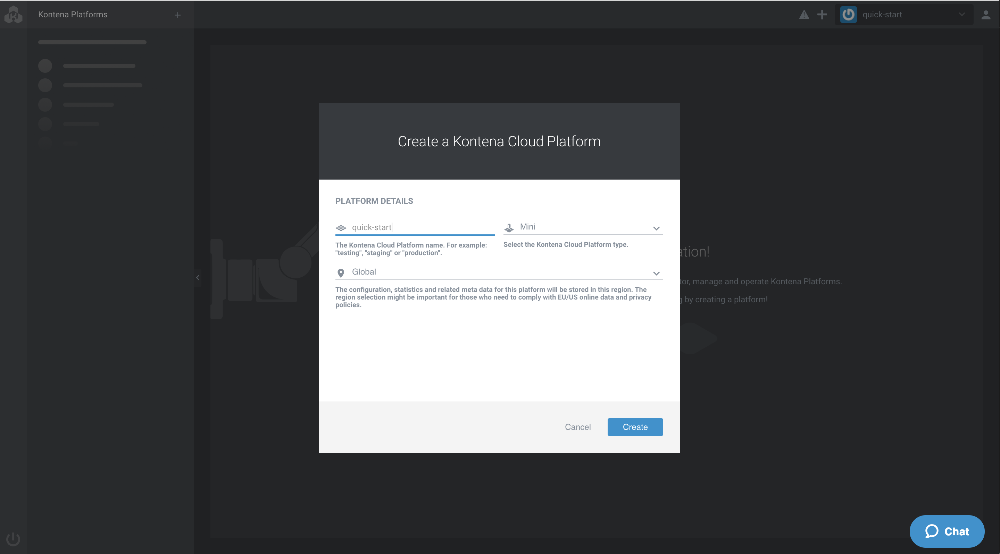
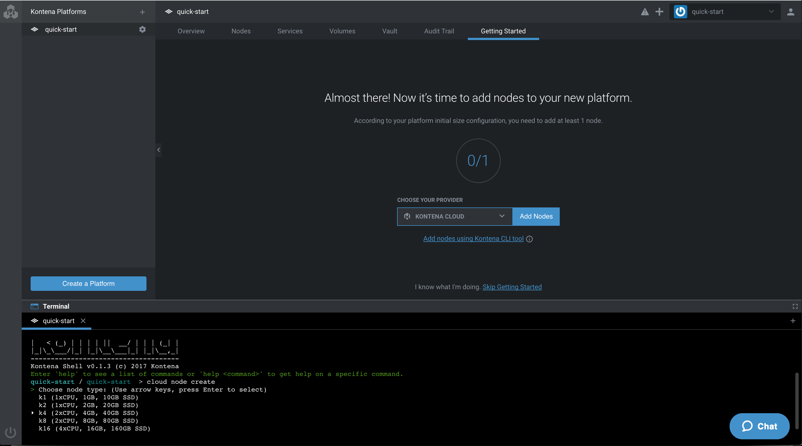
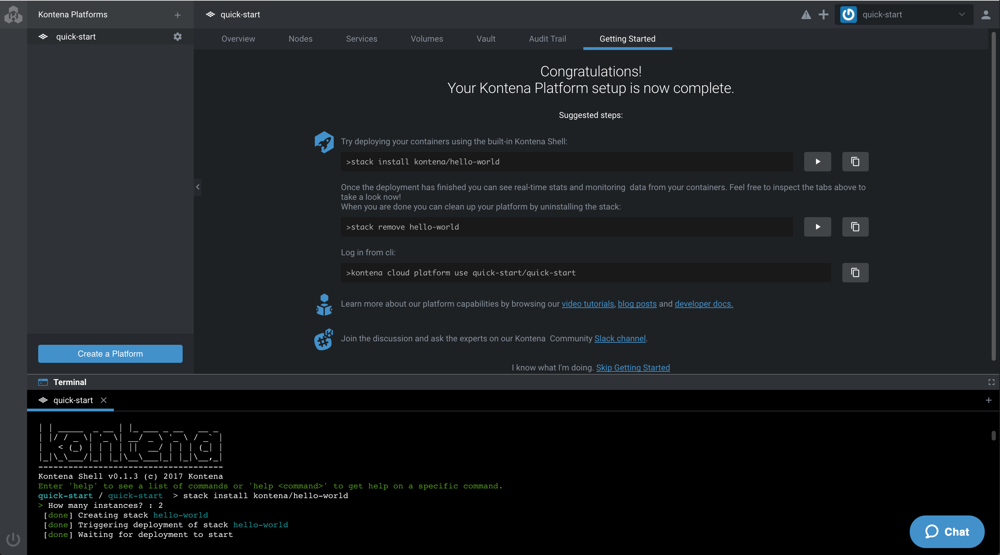

# Quick Start

The average time for Kontena users to get from zero to hero is just under 20 minutes! Let's assume you have already created some amazing application and packaged it as docker containers, here's what it takes to get from zero to hero with Kontena:

1. Sign-up to Kontena Cloud.
2. Create an organization for Kontena Platforms.
3. Create a [Kontena Platform](using-kontena/platform.md).
4. Install [Kontena Nodes](using-kontena/nodes.md).
5. Deploy first [Kontena Stack](using-kontena/stacks.md).

Follow these steps to get started with Kontena on Kontena Cloud quickly. If you like to tinker and maintain the Kontena Platform yourself, please follow the [slow start](./slow-start.md) guide.

## Step 1. Sign-up to Kontena Cloud

You can sign-up to Kontena Cloud by following this link: https://cloud.kontena.io/sign-up

## Step 2. Create an Organization

After you have signed up and verified your email, you can create an organization for your project. An organization is a workspace for development teams to monitor, manage and operate Kontena Platforms.



## Step 3. Create a Kontena Platform

Kontena Platform will abstract all available compute resources and make these resources available to your container workloads. To create your first Kontena Platform, just open the 'Create Platform' dialog and fill in the platform name. For testing purposes `Mini` platform type is enough.



After clicking 'Create' button Kontena Platform will be shortly provisioned to Kontena Cloud.

## Step 4. Install Kontena Nodes

When the platform is ready you'll need some Kontena Nodes to run your containerized workloads.

After selecting Kontena Cloud as provider and clicking 'Add nodes' button, terminal windows should open and you can choose a node type and number of nodes you want to create.



You can always execute `cloud node create` later in terminal to provision additional Kontena Nodes to your Kontena Platform.

**Note!** While Kontena will work with just a single Kontena Node, it is recommended to have at least three Kontena Nodes provisioned in a Grid.

If you followed the steps above, you should now have a working Kontena setup installed. Verify the setup using the `node list` command. It should list all the Kontena Nodes in your Kontena Platform.

```
> node list
NAME              VERSION   STATUS       INITIAL   LABELS
⊛ damp-forest-2   1.4.0     online 11s   1 / 1     region=eu-west-1,az=a,provider=kontena
```

## Step 4. Deploy Your First Application Stack

After the provisioned node is online, you are ready to deploy your first application stack. To install a ready-made stack you can execute `stack install kontena/hello-world` command in terminal.



The initial stack deployment may take some time while the host nodes pull the referenced Docker images.

After the stack deployment is finished you can verify from Kontena Cloud Dashboard that the lb and web services are running or executing `stack ls` command:

```
> stack ls
NAME            STACK                       SERVICES   STATE     EXPOSED PORTS
⊛ hello-world   kontena/hello-world:1.0.0   2          running   *:80->80/tcp
```

To test the installed stack, you must connect to the IP address of the host node publishing the `lb` service on TCP port 80. You can use the public IP address of the host node running the service instance displayed as part of the kontena service show output `service show hello-world/lb`:

```
> service show hello-world/lb
   ...
   hello-world/lb/1:
      scheduled_to: damp-forest-2
      deploy_rev: 2017-11-10 08:11:10 UTC
      rev: 2017-11-10 08:11:10 UTC
      state: running
      containers:
        hello-world.lb-1 (on damp-forest-2):
          dns: lb-1.hello-world.quick-start.kontena.local
          ip: 10.81.128.41
          public ip: 18.194.195.204
          status: running
```

You can also browse services on Kontena Cloud Dashboard to see stats, logs and configuration of each deployed stack service.

Please see the following examples for more advanced stacks:

- [PostgreSQL Cluster (stolon)](https://github.com/kontena/kontena-stacks/tree/master/stolon)
- [Kong API Gateway](https://github.com/kontena/kontena-stacks/tree/master/kong)
- [Wordpress Cluster](https://github.com/kontena/kontena-stacks/tree/master/wordpress-cluster)

## Congratulations -- Enjoy!

This completes the quick start guide for setting up Kontena. For further learning, you can continue by reading the following:

* [Kontena Platform Overview](using-kontena/README.md)
* [Platform](using-kontena/platform.md)
* [Stacks](using-kontena/stacks.md)
* [Secrets Management](using-kontena/vault.md)
* [Loadbalancer](using-kontena/loadbalancer.md)

We hope you will find this documentation helpful! If you have any suggestions on improving our documentation, please [open an issue](https://github.com/kontena/kontena/issues) on GitHub.
