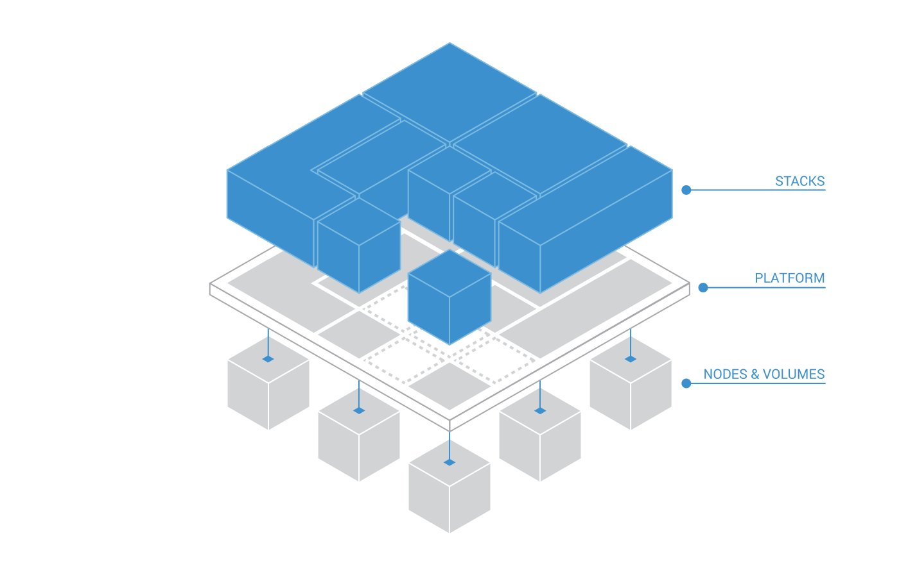

# Using Kontena

## Kontena Platform

> Kontena provides the complete environment for orchestrating and running containerized workloads. The foundation of this environment is the Kontena Platform that provides all the required technology as a tightly integrated package.

The Kontena Platform is abstracting all available [compute resources](#kontena-nodes) and [data volumes](#kontena-volumes) as a single unified resource pool, and makes it available in containerized workloads described as [Kontena Stacks](#kontena-stacks) running on top.



The Kontena Platform setup requires installation of the Kontena Platform Master and setting up the Kontena Platform Grid:

* **Kontena Platform Master** is a machine (or number of machines in high-availability setup) that provides the management API for using Kontena. It will perform the orchestration and scheduling for the container workloads. In addition, it will authenticate users, enforce policies and track all the user actions in audit log.
* **Kontena Platform Grid** is a cluster wide abstraction that is required for connecting compute resources and data volumes. It will automatically bind all connected machines together using the built-in overlay network technology and it will provide IP address management for all the containers running inside. Therefore, communication inside the Kontena Platform multi-host environment works the same as in a local area network.

The users of [Kontena Cloud](https://www.kontena.io/cloud) may use the Kontena Platform as a hosted solution that includes the Kontena Platform Master and Kontena Platform Grid fully setup and ready-to-go. Since the Kontena Platform is [open source](https://github.com/kontena/kontena), users may also choose to use [Kontena Platform Master](../advanced/master.md) with any number of [Kontena Platform Grids](../advanced/grids.md) as custom setup on any infrastructure.

See [Kontena Platform usage documentation](./platform.md) to learn how to manage, operate and monitor the Kontena Platforms.

## Kontena Nodes

Kontena Nodes (machines; bare metal or virtual) provide all the compute resources for the Kontena Platform. They are connected to the Kontena Platform from any cloud (public, private or hybrid) using the built-in overlay network technology. The number of Kontena Nodes may be adjusted according to compute resource needs. Once connected, each Kontena Node will provide additional compute resources to the pool of available resources.

Kontena Nodes connect to the Kontena Platform via a secure WebSocket channel. The WebSocket channel is used by the Kontena Platform for orchestration, as well as for stats and logs stream. The WebSocket channel is opened from the Kontena Nodes to the Kontena Platform in order to enable access to the Kontena Nodes behind the firewall.

#### Online Nodes

Kontena Stacks and Services may be deployed to any Kontena Node that is `online`.  Kontena Nodes will be considered `online` when they have an active (WebSocket) connection to the Kontena Platform. They must also respond to any ping requests within the timeout threshold, which can be configured via the Kontena Platform settings. The Kontena Platform will generate a warning log message if the response from the Kontena Node is taking too long.

At any time, when the Kontena Platform notices a new Kontena Node coming online, it will determine if there is a need to re-schedule existing Kontena Services. In order to avoid unnecessary re-scheduling, there is a 20s grace period after a Kontena Node comes online.

#### Offline Nodes

If the Kontena Node active (WebSocket) connection to the Kontena Platform is disconnected or the ping requests are timed out, the Kontena Platform will set the Kontena Node status to `offline`.

Once the Kontena Node status is offline, the Kontena Platform will start re-scheduling any stateless services away from these Kontena Nodes. In addition, these Kontena Nodes are not being used to schedule new Kontena Services. In order to avoid unnecessary re-scheduling, there is a grace period before the Kontena Services are re-scheduled. This grace period depends on the deployment strategy in use:

* **`daemon`** - 10 minutes
* **`ha`** - 2 minutes
* **`random`** - 30 seconds

#### Initial Nodes

When the Kontena Platform is created, the Kontena Platform Grid must be defined with an `initial-size` value. It will determine the number of Kontena Nodes that will become **Initial Nodes**. Initial nodes have very important role in the Kontena Platform: they maintain the distributed and reliable [etcd](https://github.com/coreos/etcd) key/value store that is used by the Kontena Platform to maintain the current state of the platform.

Once the Kontena Platform is created, Kontena Nodes may be added. The first Kontena Nodes added will automatically become Initial Nodes. They will form a distributed and reliable etcd cluster. Any additional Kontena Nodes will act as proxy nodes and they are not part of this etcd cluster. While some Kontena Nodes may be Initial Nodes, they may be used just like any other Kontena Nodes to run Kontena Stacks and Services.

With etcd, the majority of the Initial Nodes should be always online and healthy. This is to ensure that there is distributed key/value storage data consistency and replication across the cluster. A well designed production environment should be defined with an odd `initial-size` value (e.g. 3, 5 or 7). In addition, the Initial Nodes should be spread across different availability zones. Please see [etcd admin guide](https://coreos.com/etcd/docs/latest/v2/admin_guide.html#optimal-cluster-size) for further details.

#### Initial Node Failures

The majority of the Initial Nodes must be always online and healthy. Otherwise the Kontena Platform will stop working. The Kontena Platform with an `initial-size=3` is operational if one of the Initial Nodes is missing or unhealthy. The Kontena Platform with an `initial-size=5` is operational even if two Initial Nodes are missing or unhealthy. While this may sound good, it is highly recommended to repair or replace any missing or unhealthy Initial Nodes as soon as possible.

An unhealthy cluster of Initial Nodes will affect the Kontena Platform in various ways:

* Kontena Services cannot be deployed as deploying Kontena Service Instances require allocating dynamic subnet addresses. This is handled by Kontena IPAM that relies on etcd.
* Kontena Load Balancers are not updated with the new load balancing settings since this information is maintained and synchronized via etcd.
* Plus, potentially many other issues...

#### Initial Node Replacement

An Initial Node may be replaced as long as there has not been a majority loss. Simply remove the Initial Node you want to replace and add a new Kontena Node. The new Kontena Node will become an Initial Node automatically. Please note, it is not possible to promote an existing non-Initial Node to an Initial Node.

Using the method described above, it is possible to replace all Initial Nodes one by one. In any case, the majority must be kept.

#### Kontena Node Scheduling Availability

Sometimes, one or more Kontena Nodes might require maintenance, or they need to be replaced. Upon such events, minimizing disruption to the running Kontena Stacks and Services is often a top priority. This may be achieved with Kontena Node `availability` configuration. The availability of Kontena Node may be configured as `active` or `drain`:

* **`active`** - Kontena Platform will schedule workloads and treat this Kontena Node as normal. This is the default configuration for any Kontena Node.
* **`drain`** - Kontena Platform will not schedule any new workloads and all stateless services will be re-scheduled out from this Kontena Node. Any stateful services running on this Kontena Node will be stopped.

To summarize: when Kontena Nodes are maintained, it is recommended to configure their availability as `drain`. Once the maintenance is over and Kontena Node can be put back to work, their availability should be configured as `active`.

See [Kontena Nodes usage documentation](./nodes.md) to learn how to manage, operate and monitor Kontena Nodes.

## Kontena Stacks

> A single service is rarely useful on its own. Modern micro service architectures decompose applications into a number of smaller services. Even monolithic web applications typically require some external services, such as a database. Deploying applications that are composed of multiple services require careful management due to dependencies, configuration and many other factors. Kontena Stacks are used to describe such applications and make it possible to distribute, deploy and run them with ease.

Kontena Stacks are defined with [Kontena Stack Files](./stack-file.md) which describe the entire solution with a lifecycle. They are composed of [Kontena Services](#kontena-services) running on top of the Kontena Platform. Since the Kontena Platform is abstracting the underlying infrastructure, Kontena Stacks are infrastructure agnostic. In case any of the Kontena Services inside require a persistent data layer, Kontena Stacks may be used to provide [Kontena Volumes](#kontena-volumes) that are created on the fly, when needed.

With the support of powerful template language and variables substitution, Kontena Stacks may be created as infrastructure agnostic, re-usable, generic implementations. Since Kontena Stacks may be easily linked together, they are the ideal building blocks for microservice architectures.

When a Kontena Stack is deployed, a <span id="kontena-stack-instance">Kontena Stack Instance</span> is created and all the related Kontena Services will be deployed under this instance. Each instance is assigned with an unique namespace. Therefore, it is possible to run multiple instances of a Kontena Stack in a single Kontena Platform.

See [Kontena Stacks usage documentation](./stacks.md) to learn how to manage, operate and monitor Kontena Stacks.

## Kontena Services

> One of the challenges with containerized application infrastructure is the fact that you cannot rely on individual containers, because containers are ephemeral environments that come and go. They spin up and down in response to both network hardware failures and functionality built into the container orchestrator in order to support scaling, migrations, load balancing, rolling updates and restarts. While containers get their own IP addresses, those IP addresses cannot be predicted in advance. Therefore, an abstraction that defines a logical set of containers, their configuration and their desired state is needed. In Kontena, this abstraction is called a Kontena Service.

Kontena Services are part of [Kontena Stack](#kontena-stack) and describe containerized workloads with a desired state. They consume compute resources provided by [Kontena Nodes](#kontena-nodes) and storage provided by [Kontena Volumes](#kontena-volumes). They are orchestrated across the Kontena Platform according to the deploy strategy and affinity rules. Since the Kontena Platform will abstract the underlying infrastructure as single unified plane, Kontena Services may communicate with each other in multi-host environments just as in a local area network.

Kontena monitors the state of each Service instance and actively manages it to ensure the desired state of the Service. An action is triggered when there are fewer healthy instances than the desired scale of your Service, when a node becomes unavailable, or when a Service instance fails.

Each Kontena Service is based on the same image file and once deployed, will spin up one or more <span id="kontena-service-instances">Kontena Service Instances</span> (containers), depending on the Kontena Service configuration. Each Kontena Service Instance will produce statistics and log data streams. The Kontena Platform is automatically collecting all of this data and provides intuitive access to these streams on the Kontena Service, Stack and Platform level.

See [Kontena Services usage documentation](./services.md) to learn how to manage, operate and monitor Kontena Services.

## Kontena Volumes

> **IMPORTANT!** Kontena Volumes support is still experimental. The exact details of how these volumes are managed may still change as the implementation evolves. If you plan to use Kontena Volumes today, be prepared to change your volume definitions as necessary when upgrading to newer Kontena Platform versions.

Kontena Volumes provide storage (persistent; local or external) for stateful services. A Kontena Volume contains a volume configuration that abstracts an actual physical volume location. Once defined, it will be made available for Kontena Stacks via the Kontena Platform. Kontena Stacks can attach these volumes to Kontena Services. Physical Kontena Volume instances are created and attached on-demand across the Kontena Platform. The purpose of Kontena Volumes are to decouple physical infrastructure configurations and details from the application layer.

In short, here's how to use the infrastructure agnostic Kontena Volumes:

1. [Create a Kontena Volume](./volumes#create-a-kontena-volume).
2. Expose the Kontena Volume to the Kontena Stack by declaring it in the Kontena Stack File [volumes](./stack-file.md#volumes) section.
3. Mount the Kontena Volume to the Kontena Services as a named volume via the Kontena Stack File [services](./stack-file.md#services) section.

Kontena Volumes may be mounted simultaneously to multiple Kontena Services via Kontena Stacks. The Kontena Platform scheduler will automatically create multiple separate volume instances for each Kontena Volume. These volume instances correspond to specific Docker volumes on specific Kontena Nodes. The scheduling behavior of each Kontena Volume depends on the volume's scope, and any pre-existing volume instances.

The Kontena Platform tracks the available Docker volume drivers on each Kontena Node, and will only deploy Kontena Services using a volume driver onto the machine that provides that volume driver. In order to use any volume drivers aside from the default local driver, those volume drivers must be provided via Docker plugins on the Kontena Nodes. Kontena itself does not yet support provisioning Docker plugins onto the Kontena Nodes.

See [Kontena Volumes usage documentation](./volumes.md) to learn how to manage, operate and monitor Kontena Volumes.

## Kontena Vault

Often, when two different applications or services interact, they will authenticate using secrets, access tokens or something similar. Since it is bad practise to hard code or package them together with the application (or it's meta data such as `Dockerfile`, `docker-compose.yml` or `kontena.yml`), some kind of secrets management solution is needed. Kontena Vault is a secure key-value storage system that can be used to manage such secrets.

Kontena Vault is fully integrated into the Kontena Platform and may be used to manage secrets for Kontena Stacks and Services. It has built-in support for managing LetsEncrypt certificates.

See [Kontena Vault usage documentation](./vault.md) to learn how to manage secrets with Kontena Vault.

## Kontena Load Balancer

Load balancers are used to distribute traffic between different services. Therefore, having a full-featured, high-performance and reliable load balancer is one of the most essential components for building applications composed of multiple services. With Kontena, users can enjoy the Kontena Load Balancer that is built-in and deeply integrated with Kontena Platform.

The Kontena Load Balancer is built on proven technologies such as [HAproxy](http://www.haproxy.org/) and [etcd](https://github.com/coreos/etcd). It is fully automated, enabling consistent load balancing for any number of Kontena Stacks and Services. The Kontena Load Balancer key features include:

* Zero downtime
* Fully automated configuration
* Dynamic routing
* Support for TCP and HTTP traffic
* SSL termination on multiple certificates
* Link certificates from [Kontena Vault](#kontena-vault)

You can have any number of Kontena Load Balancers running on your Kontena Platform. Kontena Load Balancers are described in [Kontena Stack File](./stack-file.md). Kontena Services may be linked to this load balancer via linking. If any Kontena Service linked to the Kontena Load Balancer is scaled or re-deployed, the Kontena Load Balancer will apply the new settings on the fly, without dropping connections.

See [Kontena Load Balancer usage documentation](./loadbalancer.md) to learn how to manage and operate Kontena Load Balancer.

## Service Discovery

The Kontena Platform features built-in service discovery that provides logical DNS address for each deployed Kontena Stack and Service. This DNS address should be used in case there is any need for Kontena Stacks or Services to communicate with each other. Please note, the service discovery DNS address is internal and may be used only by Kontena Stacks and Services.

All Kontena Services in a Kontena Stack are automatically assigned a DNS address within their Kontena Stack instance namespace. For example: `api.mystack.testing.kontena.local`. The syntax is following:

```
<SERVICE_NAME>.<STACK_NAME>.<PLATFORM_GRID_NAME>.kontena.local
```

In addition, each Kontena Service instance will be assigned their own DNS address. For example: `api-1.mystack.testing.kontena.local`. The syntax is following:

```
<SERVICE_NAME>-<SERVICE_INSTANCE_NUMBER>.<STACK_NAME>.<PLATFORM_GRID_NAME>.kontena.local
```

When using a Kontena Service DNS address, the Kontena Platform will return a random Kontena Service instance address. Therefore, in most cases, it is not necessary to know the exact Kontena Service instance address. Additionally, when referencing Kontena Services within a same Kontena Stack, it is possible to only use the Kontena Service name as the address due to common DNS namespace.

If the Kontena Stack is exposing a service, it is possible to reach that Kontena Stack using the following DNS address:

```
<STACK_NAME>.<PLATFORM_GRID_NAME>.kontena.local
```

## Health Checks

The Kontena Platform comes with a mechanism to monitor the health of Kontena Services. The health status may be `healthy`, `unhealthy` (or `N/A`). This information is used to automatically restart unhealthy Kontena Service Instances. In case the Kontena Service is connected to the Kontena Load Balancer, it will automatically route traffic only to healthy Kontena Service Instances.

By default, the Kontena Platform will monitor Kontena Services and compare the number of running Kontena Service Instances against the desired state. If any instances have died, those instances will be restarted. This is done automatically and does not require any additional configuration.

Sometimes Kontena Service Instances appear to be running, but applications inside are unresponsive. In order to detect and restart such instances automatically, additional application health checks may be configured via the Kontena Stack File.

## Kontena Platform Logs

Kontena Platform Logs enable real-time access to log streams. These log streams capture all log messages (typically `STDOUT` and `STDERR`) produced by the Kontena Stacks running on top of the Kontena Platform, as well as the log messages generated by the Kontena Platform itself. All the log streams are aggregated together and they may be inspected on the Kontena Service, Stack or Platform level in real time.

In addition to real-time access, Kontena Platform Logs may be forwarded to third party log collection services.

See [Kontena Platform Logs usage documentation](./logs.md) to learn how to inspect logs in real time and how to configure external log collection service.

## Kontena Platform Statistics

Kontena Platform Statistics enable real-time access to the most recent statistics. The statistics are collected from all workloads running on top of the Kontena Platform with the help of [cAdvisor](https://github.com/google/cadvisor). When Kontena Service Instances are started, the Kontena Platform will start collecting statistics. All of the data is aggregated together and they may be inspected on the Kontena Service, Stack or Platform level in real time.

```
$ kontena service stats loadbalancer
CONTAINER                      CPU %           MEM USAGE/LIMIT      MEM %           NET I/O
loadbalancer-3                 1.67%           208.64M / N/A        N/A             61.53G/16.17G
loadbalancer-5                 1.73%           213.72M / N/A        N/A             61.7G/16.28G
loadbalancer-2                 1.59%           198.91M / N/A        N/A             61.45G/16.1G
loadbalancer-1                 1.65%           219.86M / N/A        N/A             61.57G/16.52G
loadbalancer-4                 2.05%           220.73M / N/A        N/A             61.7G/16.42G
```

In addition to real-time access, the Kontena Platform Statistics may be forwarded to third party statistics collection service.

See [Kontena Platform Statistics usage documentation](./stats.md) to learn how to inspect statistics in real time and how to configure external stats collection service.

## Usage Documentation

* [Platform](platform.md)
* [Nodes](nodes.md)
* [Stacks](stacks.md)
* [Stack Files](stack-files.md)
* [Services](services.md)
* [Volumes](volumes.md)
* [Vault](vault.md)
* [Load Balancer](loadbalancer.md)
* [Users](users.md)
* [Stats](stats.md)
* [Logs](logs.md)

## Advanced Usage Documentation

* [Platform Master](../advanced/master.md)
* [Platform Grid](../advanced/grids.md)
* [Authentication](../advanced/authentication.md)
* [Networking](../advanced/networking.md)
* [Technology](../advanced/technology.md)
* [Etcd](../advanced/etcd.md)

## Getting Started

If you are new to Kontena, we recommend that you follow the [quick start](../quick-start.md) guide.
